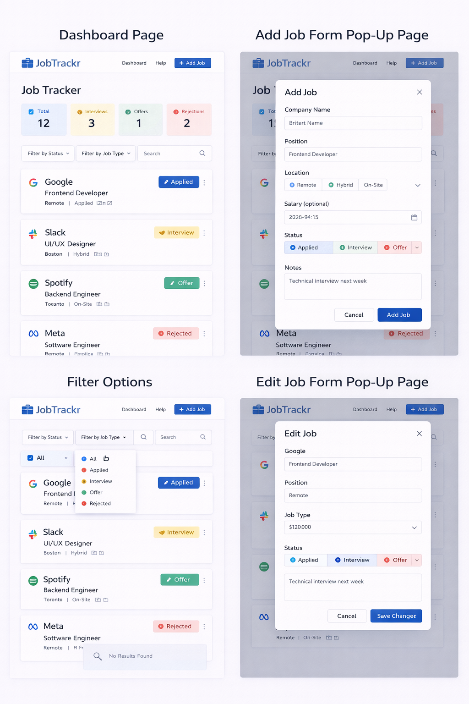

# JobTracker – Job Application Tracker (CRUD + Local Storage)

### Live Website
[View live website here: still in development](https://anaid-ariwany.github.io/Job-Tracker/)

## Project Purpose
JobTrackr is a **personal job application tracker**. It's a **personal dashboard to track jobs you applied to**.

### Example real-life flow:

1. You go to LinkedIn
2. You apply to Google for Frontend Developer
3. You get an email confirmation
4. You open your JobTrackr app
5. You manually add:

   * Company: Google
   * Position: Frontend Developer
   * Location: Remote
   * Date Applied: March 4
   * Status: Applied

That’s it. You’re logging your activity.

## What Problem Does This Solve?

When you apply to 20+ jobs, things get messy. You forget:

* Which companies you applied to
* When you applied
* Which stage you're in
* Who invited you for interview
* Who rejected you

So JobTrackr solves:

✔ Organization
✔ Visibility
✔ Tracking progress
✔ Motivation

It’s a productivity tool.

## What I'm Building

A **Job Application Tracker Web App** where users can:

* Add job applications
* Edit them
* Delete them
* Change status (Applied → Interview → Offer → Rejected)
* Filter applications
* Store everything in localStorage

## Visual Direction
Sample of the desired outcome:

